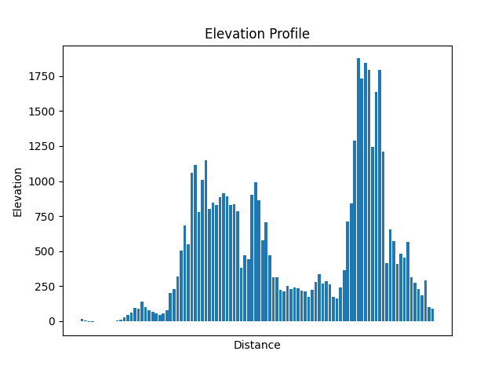
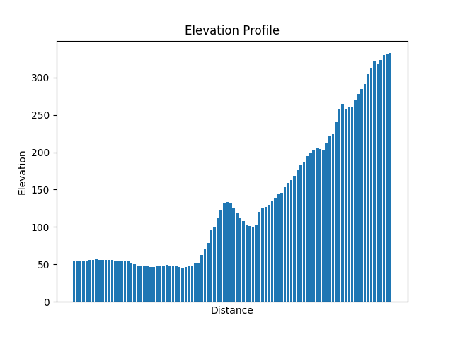

# elevation_list_googlemaps
구글 맵스를 이용해서 정해진 두 좌표의 고도 리스트를 뽑아내서 matplotlib로 그리는 파이썬 프로그램

소스의 저기 소스의 api_key 제가 예시로 한번 테스트하고 삭제했으니 바로는 실행이 안됩니다.


구글 클라우드 콘솔에 접속해서 자신의 api_key를 생성해서 써야 합니다.
https://console.cloud.google.com

구글 클라우드 콘솔에서 Google Maps를 제품을 사용하는 키를 생성하면 됩니다.
키가 외부에 노출되지 않도록 ip제한을 걸거나 잠깐 쓰고 파기하시길 권장합니다.
키가 외부에 노출되면 사람들이 사용해서 원치않는 비용을 지불할 위험이 있습니다.

```
pip3 install googlemaps polyline matplotlib streamlit
```
----


```
python3 app.py
```

> 샌프란시코에서 엘에이




> 오리교에서 불곡산
